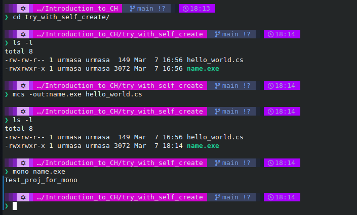

# Introduction_to_CH

<h3>I would like to know base code principce of that language<h3>

<h4>Resources</h4>
<ul>
    <li>Stepik curse ""</li>
</ul>

<h3>1) Run C# on unix\linux systems</h3>

I should know how to work with that language on my home os(Ubuty gnom and Fedora)

<h6>Run with mono</h6>

List of commands

<ul>
    <li><code>mono --help</code></li>
    <li><code>mcs -out:name.exe hello_world.cs </code></li>
    <li><code>mono name.exe</code></li>
</ul>

Example in console

<h6>Run with dotnet</h6>

List of commands

<ul>
    <li><code>dotnet new console -o name</code></li>
    <li><code>dotnet build</code></li>
    <li><code>dotnet run</code></li>
    <li>Also there are way to add new files in project</li>
    <li> first - <code>new-item YourCSharpFileName.cs</code></li>
    <li> second - <code>dotnet new class -t nameOfClass_without_extension_.cs </code></li>
    <li> as that but more options - <code>dotnet new class -t filename -o foldername</code></li>
    <li> To see more options - <code>dotnet new class -h</code></li>
</ul>

<h6>Full debug and compile in VS code</h6>

First of all, you need a dotnet lib on your laptop

The same command of projct criation

After that step we gonna use C# modules for vscode, donet into vscode, vscode 

<h3>2) GUI for applications</h3>

There are list of popular cross-platfor GUI for C# on linux/unix

<ul>
    <li><code><a href="https://github.com/AvaloniaUI/Avalonia">Avalonia</a></code></li>
    <li><code><a href="https://platform.uno/">Uno</a></code></li>
    <li><code><a href="https://learn.microsoft.com/ru-ru/dotnet/maui/what-is-maui?view=net-maui-8.0">MAUI</a></code></li>
</ul>

<h6>Avalonia in VScode</h6>

<h3>Time to code)</h3>

<h4>1. Some simple console aplication + algoritms</h4>

<h4>2. Aplication of calculater</h4>

<h4>3. Step 3 in progress :)</h4>

<h3>3) Teory update in proces</h3>
<h3><a href ="https://www.geeksforgeeks.org/c-sharp-developer-roadmap/">RoadMap</a></h3>
<ul>
    <li><a href="https://learn.microsoft.com/en-us/dotnet/csharp/language-reference/preprocessor-directives">Preprocessing</a></li>
    <li><a href="">OOPS-concepts</a></li>
    <li></li>
</ul>

<h4>3.1 Preprocessing</h4>
<h5>Preprocessing - </h5>

<h4></h4>

<h4>3.2 OOP</h4>
<h5>Класс  — в объектно-ориентированном программировании, модель для создания объектов определённого типа, описывающая их структуру (набор полей и их начальное состояние) и определяющая алгоритмы (функции или методы) для работы с этими объектами.</h5>
<h5>Объект - сущность в адресном пространстве вычислительной системы, появляющаяся при создании экземпляра класса (например, после запуска результатов компиляции и связывания исходного кода на выполнение)</h5>
<h5>Три основных принципа</h5>
<ul>
    <li>абстракция для выделения в моделируемом предмете важного для решения конкретной задачи по предмету, в конечном счёте — контекстное понимание предмета, формализуемое в виде класса</li>
    <li>инкапсуляция для быстрой и безопасной организации собственно иерархической управляемости: чтобы было достаточно простой команды «что делать», без одновременного уточнения как именно делать, так как это уже другой уровень управления</li>
    <li>наследование для быстрой и безопасной организации родственных понятий: чтобы было достаточно на каждом иерархическом шаге учитывать только изменения, не дублируя всё остальное, учтённое на предыдущих шагах</li>
    <li>полиморфизм для определения точки, в которой единое управление лучше распараллелить или наоборот — собрать воедино</li>
</ul>

<h4>3.3 Exception Handling</h4>

<code>try / catch / finnaly / throw</code>
